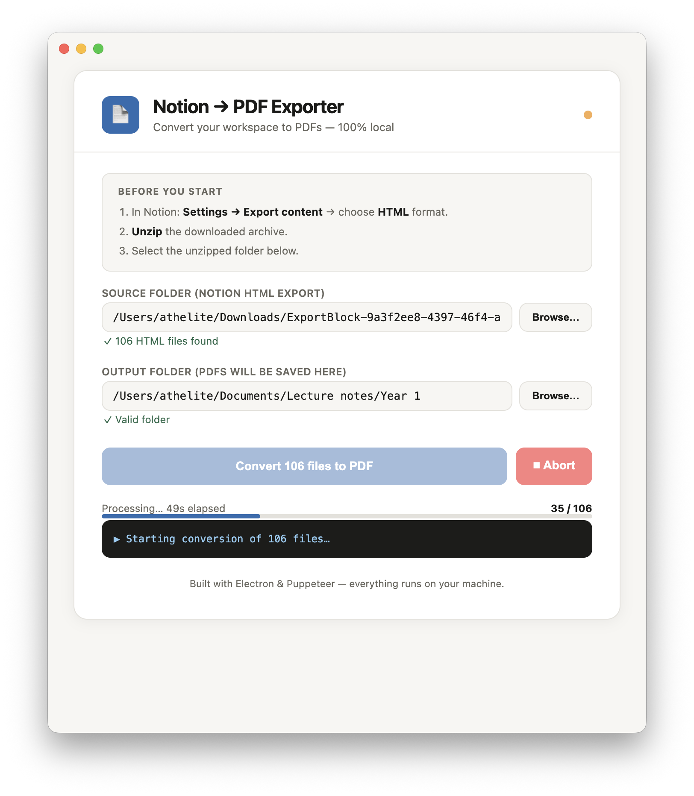

# Notion PDF Exporter

Convert your entire Notion workspace to PDFs -- 100 percent local, no subscriptions, no data leaving your machine.

[](https://github.com/yourusername/notion-pdf-exporter)
[](https://github.com/yourusername/notion-pdf-exporter)
[](https://github.com/yourusername/notion-pdf-exporter)
[](LICENSE)

---

## Why This Exists

Notion's built-in PDF export is great for single pages, but when you need to export your entire workspace with nested pages, it becomes a painful manual process.

This app solves that by:

- Preserving your folder structure -- subpages become subfolders with PDFs
- Keeping all formatting -- callouts, banners, tables, and images
- Batch processing -- convert hundreds of HTML files in one go
- 100 percent local -- no data ever leaves your machine
- Completely free -- no subscription, no account, no limits

---

## Screenshots

### Main App Interface


*Clean, native macOS interface with folder selection and progress tracking.*

### Conversion in Progress



*Live progress bar showing file-by-file conversion with detailed logs.*

### Before and After: Folder Structure


*Your Notion export folder becomes an identical PDF folder structure.*

### PDF Output Example


*Preserved formatting: callouts, tables, code blocks, and images.*

---

## Quick Start

### For Regular Users (No Technical Skills Needed)

1. Download the latest `Notion PDF Exporter.app.zip` from [Releases](https://github.com/yourusername/notion-pdf-exporter/releases)
2. Unzip the file
3. Drag `Notion PDF Exporter.app` to your Applications folder
4. Double-click to launch

> **Important:** First time opening, right-click the app, select Open, and click Open in the warning dialog. This is a one-time step.

---

## Step-by-Step Guide

### 1. Export from Notion

1. Open Notion
2. Go to Settings and Members -> Settings -> Export content
3. Click Export all workspace content
4. Choose format: HTML
5. Download and unzip the archive


### 2. Run the App

1. Open Notion PDF Exporter from your Applications folder
2. Click Browse next to Source folder and select your unzipped Notion export
3. Click Browse next to Output folder and choose where to save your PDFs
4. Click Convert X files to PDF


### 3. Find Your PDFs

PDFs are saved in the same folder structure as your Notion export:

```
Notion Export/                ->    PDF Output/
├── Work/                     ->    ├── Work/
│   ├── Project Alpha.html    ->    │   ├── Project Alpha.pdf
│   ├── Roadmap.html          ->    │   ├── Roadmap.pdf
│   └── Team/                 ->    │   └── Team/
│       └── Meeting Notes.html->    │       └── Meeting Notes.pdf
└── Personal/                 ->    └── Personal/
    └── Journal.html          ->        └── Journal.pdf
```

---

## What Gets Preserved

| Notion Feature | Preserved | How |
|----------------|-----------|-----|
| Text formatting | Yes | Full HTML-to-PDF rendering |
| Colored callouts and banners | Yes | printBackground: true |
| Tables | Yes | Auto-fit with word wrapping |
| Images | Yes | Scaled to page width |
| Code blocks | Yes | Preserved formatting |
| Nested pages | Yes | Recursive folder mirroring |
| Page breaks | Yes | Smart break-inside: avoid |
| Notion UI elements | Removed | Hidden automatically |

---

## System Requirements

| Requirement | Minimum |
|-------------|---------|
| OS | macOS 10.15 (Catalina) or newer |
| Architecture | Intel or Apple Silicon (Universal) |
| RAM | 2GB (4GB recommended for large workspaces) |
| Storage | 500MB for app plus space for PDFs |
| Internet | Not required (fully offline) |

---

## For Developers

### Build from Source

```bash
# Clone the repository
git clone https://github.com/yourusername/notion-pdf-exporter.git
cd notion-pdf-exporter

# Install dependencies
npm install

# Run in development
npm start

# Build the app
npm run dist
```

### Project Structure

```
notion-pdf-exporter/
├── main.js           # Electron main process
├── renderer.js       # App UI logic
├── preload.js        # Secure IPC bridge
├── convert.js        # PDF conversion engine (Puppeteer)
├── index.html        # App interface
├── package.json      # Dependencies and build config
└── dist/             # Built app (created by npm run dist)
```

---

## FAQ

**Q: Why is the app about 400MB?**

A: It includes a full Chromium browser via Puppeteer for perfect HTML rendering. This ensures your PDFs look identical to what you see in Notion.

**Q: Does this work with large workspaces?**

A: Yes. The app processes files one by one and shows live progress. A 500-page workspace takes about 10-15 minutes.

**Q: Will my data be sent anywhere?**

A: Never. Everything runs locally on your machine. No data ever leaves your computer.

**Q: Can I use this on Windows or Linux?**

A: Currently macOS only. Windows and Linux versions are planned.

**Q: The app won't open. What do I do?**

A: Right-click the app, select Open, and click Open in the warning. This is a macOS security measure for unsigned apps.

**Q: Some PDFs are blank?**

A: The HTML file may reference an empty page. This is normal for Notion pages that have no content.

---

## Technical Details

### How It Works

1. Scans your Notion HTML export folder recursively
2. Launches a headless Chromium browser via Puppeteer
3. Loads each HTML file with all local resources (images, CSS)
4. Injects print-optimized CSS for perfect page breaks
5. Renders to PDF with printBackground: true
6. Saves each PDF in a mirrored folder structure

### Performance

| Workspace Size | Files | Time | Memory Used |
|----------------|-------|------|-------------|
| Small | 1-50 | 1-2 min | ~200 MB |
| Medium | 50-200 | 3-5 min | ~300 MB |
| Large | 200-1000 | 10-20 min | ~500 MB |

---

## Contributing

Contributions are welcome. Please:

1. Fork the repository
2. Create a feature branch
3. Submit a Pull Request

### Development Setup

```bash
npm install
npm start
```

---

## License

MIT License - free for personal and commercial use.

---

## Credits

- Built with [Electron](https://www.electronjs.org/)
- PDF rendering by [Puppeteer](https://pptr.dev/)
- Icons by [Icons8](https://icons8.com/)

---

## Support

- Issues: [GitHub Issues](https://github.com/yourusername/notion-pdf-exporter/issues)
- Discussions: [GitHub Discussions](https://github.com/yourusername/notion-pdf-exporter/discussions)

---

## Screenshot Placeholder Images

To create the screenshot images for your README:

1. Take screenshots of the app in action
2. Save them in a `screenshots/` folder
3. Update the image paths in the README

### Quick Screenshot Guide

| Screenshot | What to capture |
|------------|-----------------|
| app-main.png | The main app window with empty fields |
| conversion-progress.png | App during conversion with progress bar |
| folder-structure.png | Finder showing source and output folders side-by-side |
| pdf-output.png | A rendered PDF showing preserved formatting |
| notion-export.png | Notion's export settings dialog |
| app-action.gif | Screen recording of the conversion process |

---

## Download

Get the latest release:

[](https://github.com/yourusername/notion-pdf-exporter/releases/latest)

---

Built for the Notion community.
